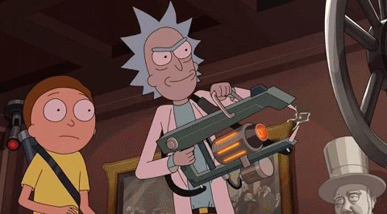
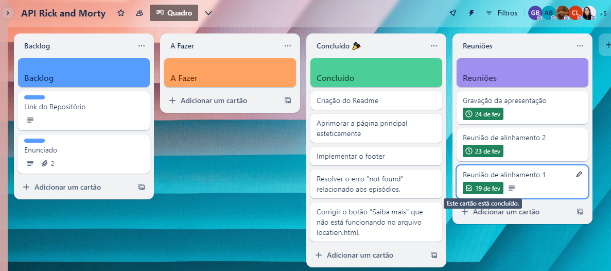

##  Índice 
- [Consumo de API com Flask](#consumo)
- [Enunciado](#enunciado)
- [Resolução](#resolucao)

##  Consumo de API com Flask
> O seriado Rick and Morty é um desenho animado americano de comédia e ficção científica criado por Justin Roiland e Dan Harmon para o bloco de programação noturno Adult Swim, exibido no canal Cartoon Network. A série acompanha as perigosas aventuras do cientista louco Rick e seu neto Morty, que divide seu tempo entre a vida familiar e
viagens interdimensionais. A série é inspirada em Back to the Future e Doctor Who.

    

A API do Rick and Morty é uma API pública que contém informações sobre os personagens da série. A documentação da API pode ser encontrada neste [link](https://rickandmortyapi.com/documentation/#rest).

##  Enunciado

> A API possui três endpoints: um para listar os personagens, um para listar as localizações e dimensões e um para listar os episódios. O objetivo deste exercício é adicionar novas funcionalidades ao projeto.

1. `GET` `/locations` - Criar uma nova rota para listar as localizações.
    - A página deverá ser renderizada através do template locations.html.
    - A página deverá conter uma tabela com as seguintes informações: nome, tipo e dimensão.
    - A tabela deverá conter um link para a página de perfil da localização.
2. `GET` `/episodes` - Criar uma nova rota para listar os episódios.
    - A página deverá ser renderizada através do template episodes.html.
    - A página deverá conter uma tabela com as seguintes informações: nome, data de lançamento e código.
    - A tabela deverá conter um link para a página de perfil do episódio.
3. `GET` `/location/<id>` - Criar uma nova rota para exibir o perfil da localização.
    - A página deverá ser renderizada através do template location.html.
    - A página deverá conter as seguintes informações: nome, tipo, dimensão e uma lista com os personagens que aparecem na
    localização.
    - A lista deverá conter um link para a página de perfil
    do personagem.
4. `GET` `/episode/<id>` - Criar uma nova rota para exibir o perfil do episódio.
    - A página deverá ser renderizada através do template episode.html.
    - A página deverá conter as seguintes informações: nome, data de lançamento, código e uma lista com os personagens que
    aparecem no episódio.
    - A lista deverá conter um link para a página de perfil do personagem.
5. Na página de perfil do personagem, adicione as seguintes informações: espécie, gênero, origem e localização. As informações de origem, localização e episódios em que o personagem aparece devem conter um link para a página de perfil da localização.

##  Resolução

Os exercícios foram resolvidos em grupo através de chamadas via Discord e organizados de acordo com um quadro Kanban no Trello:

Nas reuniões indentificávamos o que era preciso ser feito e criávamos as tarefas de acordo com o que foi discutido.

##  Integrantes 

<table>
  <tr>
    <td><a href="https://github.com/alynebrasil"> <b>Alyne Brasil</b></a> <a href="https://github.com/alynebrasil">👩‍💻</a></td>
    <td><a href="https://github.com/anamariagds"> <b>Ana Maria Gomes</b></a> <a href="https://github.com/anamariagds">👩‍💻</a></td>
    <td><a href="https://github.com/cibelemoraes"> <b>Cibelle Moraes</b></a> <a href="https://github.com/cibelemoraes">👩‍💻</a></td>
    <td><a href="https://github.com/danisoaresl"> <b>Daniele Soares</b></a> <a href="https://github.com/danisoaresl">👩‍💻</a></td>
    <td><a href="https://github.com/gabiapp"> <b>Gabriela Nunez</b></a> <a href="https://github.com/gabiapp">👩‍💻</a></td>
    </tr>
    <tr>
    <td><a href="https://github.com/GessycaBorges"> <b>Gessyca Borges</b></a> <a href="https://github.com/GessycaBorges">👩‍💻</a></td>
    <td><a href="https://github.com/OrcFofa"> <b>Laura Santos</b></a> <a href="https://github.com/OrcFofa">👩‍💻</a></td>
    <td><a href="https://github.com/liviazeviani"> <b>Lívia Zeviani</b></a> <a href="https://github.com/liviazeviani">👩‍💻</a></td>
    <td><a href="https://github.com/Renatarafaelaalves"> <b>Renata Rafaela Alves</b></a> <a href="https://github.com/Renatarafaelaalves">👩‍💻</a></td>
    <td><a href="https://github.com/thaynarlt"> <b>Thayná Tolentino</b></a> <a href="https://github.com/thaynarlt">👩‍💻</a></td>
  </tr>
</table>

